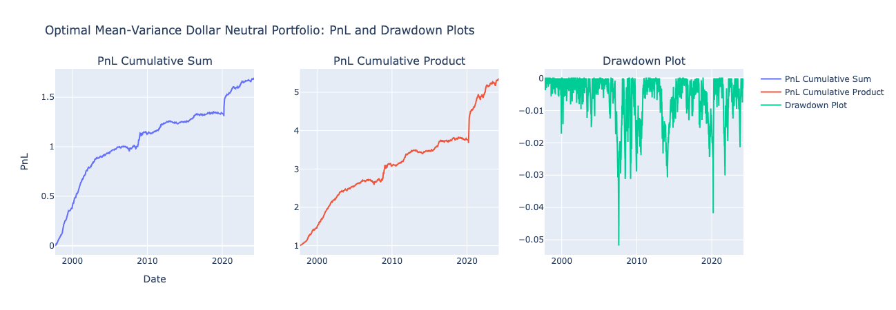
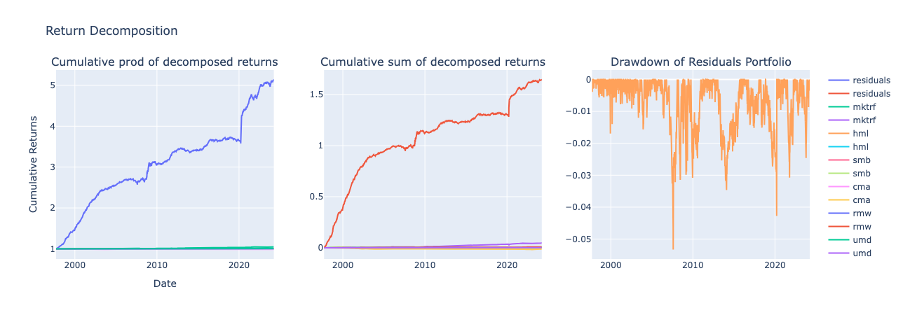
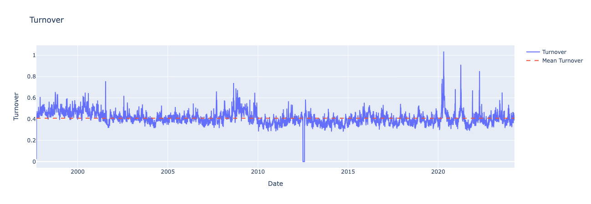
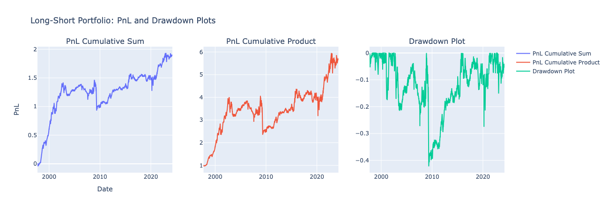
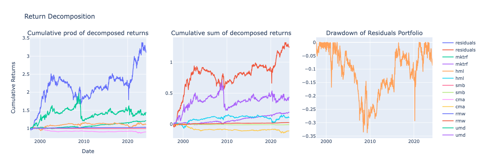

# Idiosyncratic Momentum Strategy

## Description
This project replicates and extends the findings of the seminal 2011 paper on idiosyncratic momentum by Blitz, Huij, and Marten. It focuses on exploiting firm-specific return patterns driven by investor underreaction to news and institutional neglect of idiosyncratic information. Key components include constructing idiosyncratic momentum signals, building naive and optimized portfolios, and evaluating performance.

## Features
- **Economic Rationale**:
  - Based on underreaction hypothesis and institutional negligence.
  - Investors underreact to firm-specific news, leading to sustained return patterns.
- **Signal Construction**:
  - Used residuals from Fama-French 5-factor regressions to calculate idiosyncratic momentum signals.
  - Signals adjusted for volatility and analyzed over a rolling window.
- **Portfolio Strategies**:
  - Created long-short decile portfolios based on idiosyncratic momentum scores.
  - Optimized a dollar-neutral portfolio using Barra covariance forecasts.
- **Performance Evaluation**:
  - Evaluated portfolios through Sharpe ratios, alpha (to Fama-French 5-factor + Momentum model), and factor attribution.
  - Included metrics for turnover and alpha decay.

## Results
### Optimal Mean-Variance Portfolio

### Return Decomposition

### Turnover Analysis

### Long-Short Portfolio

### Factor Attribution on Long-Short Portfolio

## License
This project is licensed under the MIT License. See the [LICENSE](LICENSE) file for details.

## Author
Dipesh Ghimire

For inquiries or contributions, please reach out via [email](mailto:dipeshghimire777@gmail.com).
